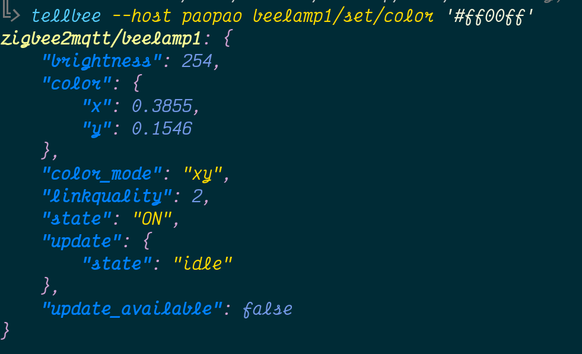

# beehive – your zigbee command-line service

beehive wants to be a set of scripts to send commands to your zigbee devices
via zigbee2mtqq.

It performs the same role as mosquitto-pub, but in a more limited way that is
tailored specifically to zigbee2mtqq, with niceties such as shorter syntax,
printing responses on console, and formatting/colouring of json.

Still alpha/experimental.



# What's working right now

 - publishing to publishable topics
 - automatically wait for a relevant message after publication, pretty-prints
   it colorfully
 - detailed logs
 - saves some typing
 - convenient syntax for key:value json, use at your own peril, it’s dangerous
 
(it’s yaml)

Sample working commands:

```bash
tellbee myikealamp/set/state on

tellbee --host raspberry myikealamp/get/color

tellbee myikealamp/set/color '#ff00ff'

# proper json
tellbee myikealamp/set '{"color": "#0000ff", "transition": 2}'

# hacky version
tellbee myikealamp/set color:#0000ff,transition:2

tellbee --host paopao bridge/request/health_check --timeout 10 --qos 0 --debug
```

# References

 - https://www.zigbee2mqtt.io/information/mqtt_topics_and_message_structure.html
 - logfiles of whichever host is running z2m

# TODO

 - solve the push issue: how can we request at command-line time the
   information that z2m publishes at its own leisure?
   - is there a way to trigger topics after subscribing?
   - else we'll have to leave a lil dæmon running client-side
   - oor, dig through the syslog sever-side
   - ooor, ask z2m to reload itself :>
   - if a way is found, we could:
     - list devices
     - list device's capabilities
     - set friendly name
     - other kinds of bridge and device info
 - separate library/script code better
 - and write a beesaid(1)
 - static typing checks
 - auto color
 - pypi pkg
 - passwd auth
 - ssl auth
 - conf file for default options
